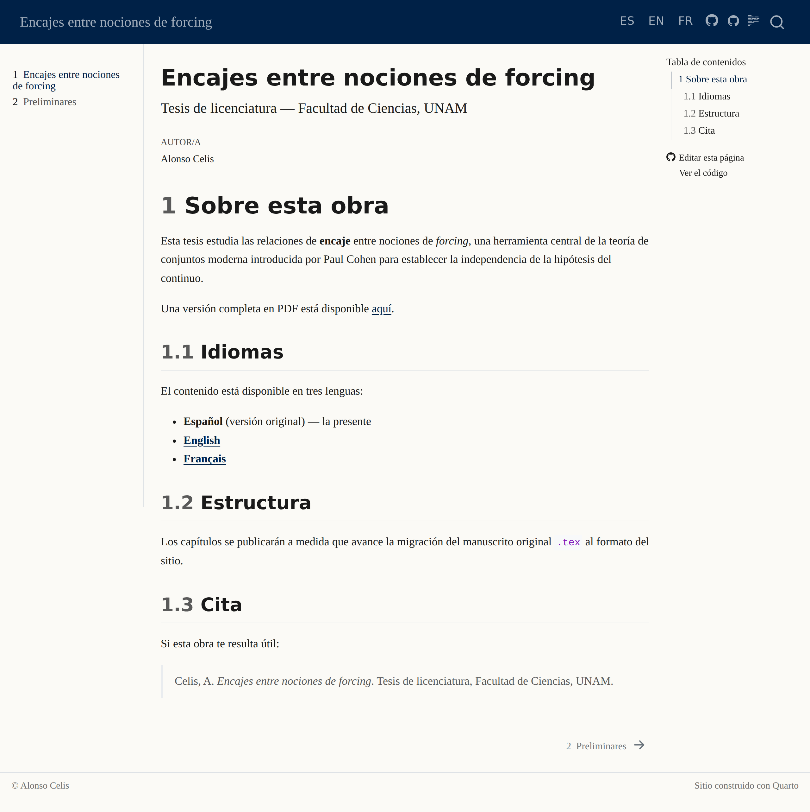
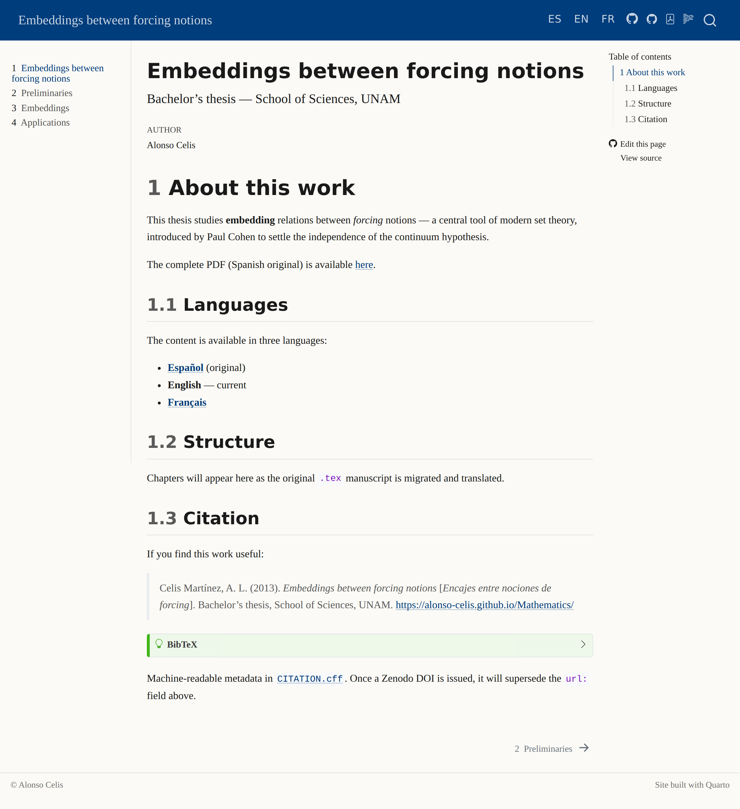
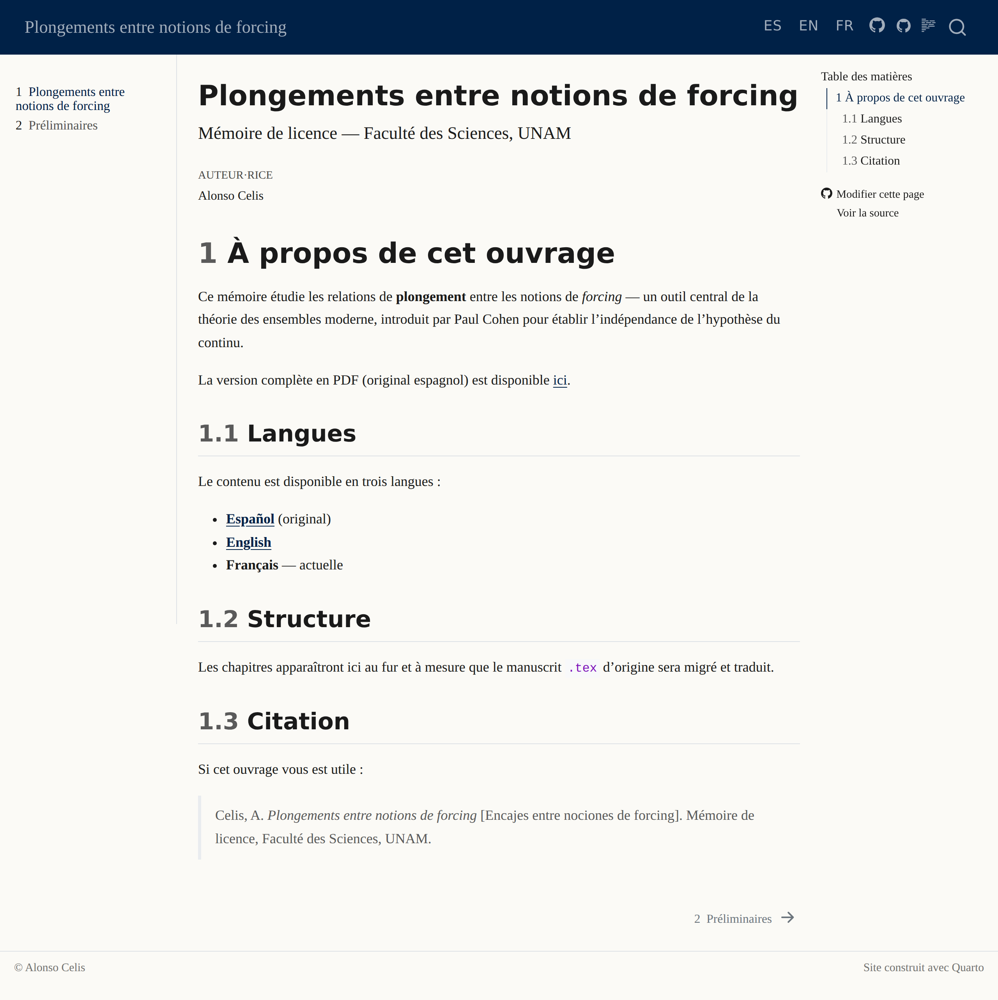

# Mathematics — Memorias de licenciatura y maestría

[](https://github.com/Alonso-Celis/Mathematics/actions/workflows/publish.yml)

This repository hosts mathematics memoirs by **Alonso Celis**, served as a
multilingual static site on GitHub Pages.

## Live site

| Language          | URL                                                                        |
|-------------------|----------------------------------------------------------------------------|
| 🇲🇽 Español       | <https://alonso-celis.github.io/Mathematics/>                              |
| 🇬🇧 English       | <https://alonso-celis.github.io/Mathematics/en/>                           |
| 🇫🇷 Français      | <https://alonso-celis.github.io/Mathematics/fr/>                           |

The full thesis — *Encajes entre nociones de forcing* — is published in all
three languages: landing + Preliminares + Encajes + Aplicaciones, with
cross-referenced theorems, proofs, the canonical bibliography
([Kunen](references.bib), Jech, Shelah, Krivine, …), a per-language
"Download PDF" button on every page, and a built-in search restricted to
the visitor's current language.

### Landing pages

<a href="https://alonso-celis.github.io/Mathematics/">
  
</a>
<a href="https://alonso-celis.github.io/Mathematics/en/">
  
</a>
<a href="https://alonso-celis.github.io/Mathematics/fr/">
  
</a>

<sub>
🇲🇽 <a href="https://alonso-celis.github.io/Mathematics/">Español</a>
&nbsp;·&nbsp;
🇬🇧 <a href="https://alonso-celis.github.io/Mathematics/en/">English</a>
&nbsp;·&nbsp;
🇫🇷 <a href="https://alonso-celis.github.io/Mathematics/fr/">Français</a>
</sub>

Full-page chapter captures (multi-MB each) live alongside the landings:
[`chapter-es.png`](assets/screenshots/chapter-es.png) ·
[`chapter-en.png`](assets/screenshots/chapter-en.png) ·
[`chapter-fr.png`](assets/screenshots/chapter-fr.png).

## Current memoir

**Encajes entre nociones de forcing** — Bachelor's thesis, Faculty of
Sciences, UNAM (2013). Original Spanish PDF:
[`pdf/ENCAJES_ENTRE_NOCIONES_DE_FORCING.pdf`](pdf/ENCAJES_ENTRE_NOCIONES_DE_FORCING.pdf).
LaTeX source under [`tex-source/`](tex-source/) with
[`MIGRATION.md`](tex-source/MIGRATION.md) describing the `.tex → .qmd`
recipe and the EN/FR terminology glossaries.

A second document, `pdf/StageAlonsoCELIS.pdf` (Master internship report),
is archived but not yet integrated into the site.

## Repo structure

```
.
├── _quarto.yml                 # Shared base (no chapter list)
├── _quarto-es.yml              # Spanish profile  (root /)
├── _quarto-en.yml              # English profile  (/en/)
├── _quarto-fr.yml              # French profile   (/fr/)
├── _brand.yml                  # Palette + typography
├── index.{es,en,fr}.qmd        # Landing pages per language
├── chapters/                   # One trio (.es / .en / .fr) per chapter
├── references.bib              # Shared bibliography
├── assets/
│   ├── css/custom.scss         # Academic typography
│   ├── logos/                  # UNAM escudos (escudo-unam, escudo-ciencias)
│   └── screenshots/            # Live-site PNGs (refreshed by workflow)
├── scripts/screenshot.js       # Playwright driver for site captures
├── tex-source/                 # Frozen original LaTeX + glossaries
├── pdf/                        # Source PDFs
└── .github/workflows/
    ├── publish.yml             # Build + deploy on every push to main
    └── screenshots.yml         # Manual: refresh assets/screenshots/
```

## Local preview

Requires [Quarto](https://quarto.org) ≥ 1.5:

```bash
quarto render --profile es      # build Spanish at _site/
quarto render --profile en      # build English at _site/en/
quarto render --profile fr      # build French at _site/fr/
quarto preview --profile es     # local server, Spanish
```

## Publishing

Push to `main` → GitHub Actions renders all three languages and deploys to
GitHub Pages.

One-time setup: in repository **Settings → Pages**, select **Build and
deployment: GitHub Actions**.

## Citing this work

Machine-readable metadata lives in [`CITATION.cff`](CITATION.cff) — GitHub
renders a *"Cite this repository"* widget from it in the sidebar. BibTeX:

```bibtex
@phdthesis{celis2013encajes,
  author    = {Celis Mart{\'i}nez, Alonso Lenin},
  title     = {Encajes entre nociones de forcing},
  school    = {Facultad de Ciencias, UNAM},
  type      = {Tesis de licenciatura},
  year      = {2013},
  url       = {https://alonso-celis.github.io/Mathematics/}
}
```

### Minting a Zenodo DOI

A persistent DOI can be issued automatically through the GitHub–Zenodo
integration. One-time setup (Alonso):

1. Sign in to <https://zenodo.org/> with your GitHub account.
2. Visit <https://zenodo.org/account/settings/github/> and toggle the
   `Alonso-Celis/Mathematics` repository **on**.
3. Cut a release on GitHub:
   ```bash
   gh release create v1.0.0 \
     --title "v1.0.0 — Spanish layer + EN/FR translations of all chapters" \
     --notes "Trilingual publication of *Encajes entre nociones de forcing*."
   ```
4. Zenodo picks up the release within a minute, archives the tarball,
   and issues a DOI (e.g. `10.5281/zenodo.XXXXXXX`).
5. Add the DOI to `CITATION.cff` (uncomment the `doi:` field) and
   replace the placeholder badge below with the live one from Zenodo.

Until the first release is cut, the placeholder above stands.

[](https://zenodo.org/)

## Refreshing site screenshots

```bash
gh workflow run "Capture screenshots"
```

Opens a `bot/screenshots` PR adding refreshed PNGs under
`assets/screenshots/`. Driven by `scripts/screenshot.js`
(Chromium / Playwright). Re-running updates the same branch.

## License

The text and figures of each memoir are © Alonso Celis. The site
infrastructure (configs, workflow, theme, scripts) is released under the
MIT License.
